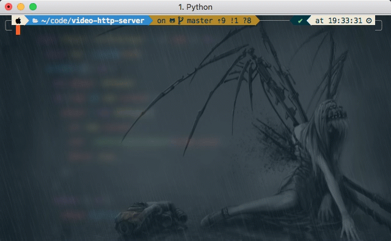

# video-http-server

[](https://www.npmjs.com/package/video-http-server) [](https://app.travis-ci.com/XYShaoKang/video-http-server)

video-http-server 是一个命令行工具,在任意目录启动一个服务,用以通过浏览器查看目录下的视频文件.

```sh
npm install -g video-http-server
# or
yarn global add video-http-server
```

然后在任意目录下运行`video-http-server`或者`vhs`命令,打开[http://localhost:9011](http://localhost:9011),可以在浏览器中查看当前目录下的文件夹,以及其中的 mp4 视频文件

[](https://asciinema.org/a/NcbE2NzqgN1iYc2v32r4xI9zT)

## 关于

此存储库是一个 [monorepo](https://en.wikipedia.org/wiki/Monorepo),使用 [Rush](https://rushjs.io/) 构建.

## 文档

- [概述](./doc/overview.md)
- [维护指南](./doc/maintainers.md)

## 项目列表

| Folder                                        | Version                                                                                                                             | Changelog                                       | Description                    |
| --------------------------------------------- | ----------------------------------------------------------------------------------------------------------------------------------- | ----------------------------------------------- | ------------------------------ |
| [video-http-server](./apps/video-http-server) | [](https://www.npmjs.com/package/video-http-server) | [change](./apps/video-http-server/CHANGELOG.md) | Video http server              |
| [front-end](./apps/front-end)                 | (local project)                                                                                                                     |                                                 | video-http-server 所使用的前端 |
