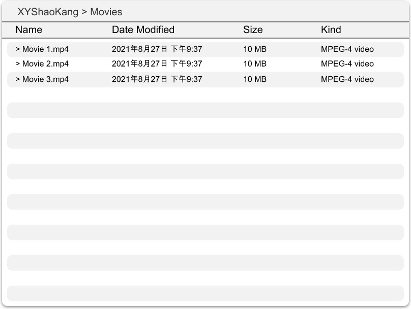
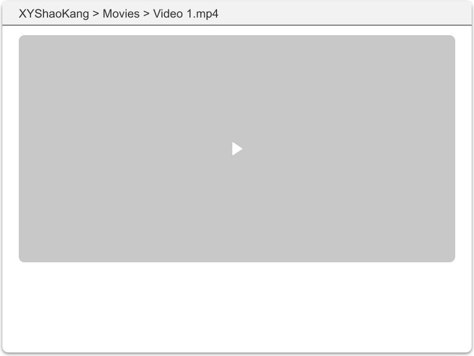

# 概述

## 背景

需要能在局域网中通过 Web 的方式访问计算机上某个目录内的视频

## 需求

> 其实有一个类似的工具可以使用[http-server](https://github.com/http-party/http-server),但是`http-server`输出的页面过于简单,不能很好的满足需求.

- 通过 CLI 启动一个 Web 服务器,提供对当前目录下的视频文件的访问
- 专门针对视频进行优化,提供视频展示模板,预览和视频播放等功能

## UI

列表页

播放页

## 实现

- 8.23 搭建前端环境
- 8.24 搭建 CLI 环境
- 8.28 完成列表展示和视频预览功能
- 8.29 完善测试
